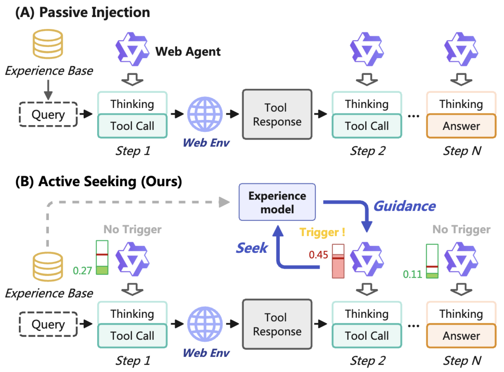

# ExpSeek: Self-Triggered Experience Seeking for Web Agents

<div align="center">
  <a href="https://arxiv.org/abs/2601.08605"></a>
  <a href="doc/expseek_documentation.md"></a>
  <a href="doc/expseek_documentation_zh.md"></a>
</div>

## 🚀 Release

**[2025/03/25]** We have open-sourced the ExpSeek codebase, including a lightweight 
ReAct implementation, the core method, and various ablation study configurations.

**[2025/01/13]** We have released our paper on arXiv:
[ExpSeek: Self-Triggered Experience Seeking for Web Agents](https://arxiv.org/abs/2601.08605)


## 📖 Introduction

<div align="center">
  
</div>

We propose **ExpSeek**, a novel paradigm for experience utilization in web agents:

1. **Step-level experience injection** — guidance is provided at each reasoning 
   step rather than at the trajectory level.
2. **Entropy-based triggering** — step-level token entropy is used to determine 
   whether experience injection is needed.
3. **Context-aware guidance generation** — guidance is generated online by 
   combining the current context with a historical experience knowledge base, 
   making it highly effective.

We evaluate ExpSeek on an open-ended DeepResearch benchmark and achieve 
significant improvements. We believe ExpSeek represents a promising direction 
for experience-driven intervention in agent reasoning, with substantial potential 
for future exploration.


## 📦 Contents

### Prerequisites

Before getting started, please ensure you have the following:

1. **GPU(s) for the inference model** — defaults to two A100s, but a single A100 
   is sufficient for Qwen3-8B inference (with reduced concurrency).
2. **GPU(s) for entropy computation** — defaults to two A100s.
3. **Jina API key** — obtain at [https://jina.ai](https://jina.ai).
4. **Web search API key** — this project uses BrightData; 
   obtain at [https://www.bright.cn](https://www.bright.cn).


### Step 1: Set Up the Environment

```bash
# Create the conda environment (recommended)
conda env create -f environment.yml

# Install additional pip dependencies
pip install -r requirements.txt
```

> **Note on `flash_attn`:** If installation fails, download the pre-built wheel 
> manually from:  
> [https://github.com/Dao-AILab/flash-attention/releases/tag/v2.7.4.post1](https://github.com/Dao-AILab/flash-attention/releases/tag/v2.7.4.post1)  
> Look for: `flash_attn-2.7.4.post1+cu12torch2.4cxx11abiFALSE-cp310-cp310-linux_x86_64.whl`


### Step 2: Build the Offline Experience Knowledge Base

We sampled 170 queries from WebwalkerQA as the training set for offline 
experience construction.

#### Step 2-1: Collect Agent Trajectories

First, launch the vllm inference server with Qwen3-8B:

```bash
bash scripts/start_vllm_8b.sh
```

Then run standard ReAct inference to collect trajectories (5 rollouts per query):

```bash
python scripts/run_inference.py --config configs/vanilla-vllm-entropy.yaml
```

#### Step 2-2: Build the Experience Knowledge Base

```bash
bash run_build_kb.sh
```

This script executes six sub-steps. By default, **Step 6 (embedding computation) 
is disabled**. To enable it, set `RUN_EMBEDDING=true` in the script — make sure 
the embedding API key is configured beforehand.

> **Demo:** We provide a complete sample knowledge base built from 30 training 
> queries under `experience_base/demo/Qwen3-8B/` for reference.  
> You can set `EXP_KB_DIR` to a custom path to generate your own experience base.


### Step 3: Run Inference with Experience Augmentation

Before running, ensure you have:
- A built experience knowledge base
- Additional GPU(s) available for entropy computation

```bash
python scripts/run_inference.py --config configs/expseek_core.yaml
```


### Step 4: Evaluate

```bash
bash run_eval.sh
```

Evaluation results will be saved in the corresponding output directory.  
We provide detailed result logs for reference.

> 📄 Comprehensive parameter reference documents are also provided:  
> [English Documentation](doc/expseek_documentation.md) | [中文文档](doc/expseek_documentation_zh.md)  
> The codebase is highly flexible — we recommend reading them before customizing
> your experiments.


## 📝 Citation

If you find our work useful, please consider citing our paper:

```bibtex
@misc{zhang2026expseekselftriggeredexperienceseeking,
      title={ExpSeek: Self-Triggered Experience Seeking for Web Agents}, 
      author={Wenyuan Zhang and Xinghua Zhang and Haiyang Yu and Shuaiyi Nie and Bingli Wu and Juwei Yue and Tingwen Liu and Yongbin Li},
      year={2026},
      eprint={2601.08605},
      archivePrefix={arXiv},
      primaryClass={cs.CL},
      url={https://arxiv.org/abs/2601.08605}, 
}
```
