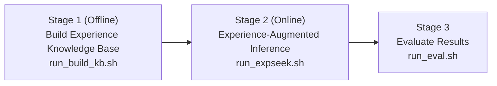

# ExpSeek Configuration and Parameter Documentation

This document is a complete parameter reference manual for ExpSeek, serving as a detailed supplement to the README and covering all configuration items, the offline construction workflow, and the online inference workflow.

## Table of Contents

1. [System Overview](#1-system-overview)
2. [Project Structure](#2-project-structure)
3. [Complete Workflow Diagram](#3-complete-workflow-diagram)
4. [Configuration File Description](#4-configuration-file-description)

   * 4.1 [Configuration File Comparison](#41-configuration-file-comparison)
   * 4.2 [Detailed Explanation of All Parameters](#42-detailed-explanation-of-all-parameters)
5. [Step-by-Step Operation Guide](#5-step-by-step-operation-guide)

   * 5.1 [Start the vLLM Inference Service](#51-start-the-vllm-inference-service)
   * 5.2 [Stage 1: Offline Experience Base Construction](#52-stage-1-offline-knowledge-base-construction)
   * 5.3 [Stage 2: Experience-Augmented Inference](#53-stage-2-experience-augmented-inference)
   * 5.4 [Stage 3: Evaluation](#54-stage-3-evaluation)
6. [Output Directory Structure](#6-output-directory-structure)
7. [Experience Base File Structure](#7-knowledge-base-file-structure)
8. [Entropy Triggering Mechanism](#8-entropy-triggering-mechanism)
9. [Adapting to Other Models](#9-adapting-to-other-models)
10. [Frequently Asked Questions](#10-frequently-asked-questions)

## 1. System Overview

The complete execution of ExpSeek is divided into three stages, executed in sequence:



The entire system involves the following model roles:

| Role                          | Function                                                        | Default Configuration       |
| ----------------------------- | --------------------------------------------------------------- | --------------------------- |
| **Inference Model**           | Web Agent that performs ReAct reasoning                         | Qwen3-8B (local vLLM)       |
| **Entropy Computation Model** | Computes token-level entropy for each step                      | Same as the inference model |
| **Guide Model**               | Generates guidance based on context and the knowledge base      | Qwen3-235B-A22B (API)       |
| **Summarization Model**       | Summarizes webpage content inside the visit tool                | Qwen3-235B-A22B (API)       |
| **Evaluation Model**          | LLM-as-a-judge that evaluates whether the prediction is correct | Qwen3-235B-A22B (API)       |

---

## 2. Project Structure

```
EXPSEEK-MAIN/
├── assets/                      # README images
├── configs/                     # All YAML configuration files
├── data/                        # Benchmark datasets
│   ├── gaia.jsonl               # GAIA benchmark
│   ├── seal-hard.jsonl          # SEAL-HARD benchmark
│   ├── xbench.jsonl             # xbench-DeepSearch benchmark
│   ├── webwalker_test.jsonl     # WebWalkerQA test set
│   ├── webwalker_train.jsonl    # Full WebWalkerQA training set (170 samples)
│   └── webwalker_train_demo.jsonl  # Reduced demo training set (30 samples)
├── experience_base/             # Directory for storing the experience knowledge base
│   └── demo/
│       ├── Qwen3-8B/            # demo KB (built from 30 training samples)
│       │   └── embedding/       # embedding index (output of Step 6)
│       └── Qwen3-8B-zh/         # Chinese reference KB (only 1 experience per topic, for reference only)
├── expseek/                     # Core source code
│   ├── agent/                   # Agent logic (ReAct loop, prompts)
│   ├── llm/                     # LLM client utilities
│   ├── tools/                   # Search and Visit tools
│   └── trigger/                 # Entropy computation server
├── offline/                     # Offline KB construction scripts (step1 to step6)
├── outputs/                     # Inference output directory (auto-created)
├── scripts/                     # run_inference.py, evaluate.py, metric.py
├── tokenizer/                   # Preloaded Qwen3-8B tokenizer
├── logs/                        # vLLM service logs (auto-created)
├── environment.yml
├── requirements.txt
├── run_build_kb.sh              # Entry point for Stage 1
├── run_expseek.sh               # Entry point for Stage 2
└── run_eval.sh                  # Entry point for Stage 3
```

> **About the `tokenizer/` directory**: The project comes with the tokenizer for Qwen3-8B preloaded, used only for token counting (context length budget checks and metric statistics), and is ready to use out of the box. If you replace the inference model, you need to replace the contents of this directory with the tokenizer of the corresponding model to ensure accurate token counting.

---

## 3. Complete Workflow Diagram

```
webwalker_train_demo.jsonl (or the full training set)
        │
        ▼
[Start vLLM Service]  ←─ scripts/start_vllm_8b.sh
        │
        ▼
[Collect Trajectories]  ←─ configs/vanilla-vllm-entropy.yaml
  run_inference.py → outputs/.../iter*.jsonl
        │
        ▼
[Evaluate Trajectories]  ←─ run_eval.sh
  outputs/.../eval_results/eval_round*.jsonl
        │
        ▼
[Stage 1: Build Knowledge Base]  ←─ run_build_kb.sh
  ├── Step 1: Aggregate rollouts → pair.jsonl
  ├── Step 2: LLM generates experience triplets → pair-EXP.jsonl
  ├── Step 3: LLM labels topics → EXP-KB-process-label.jsonl
  │                             EXP-KB-final-label.jsonl
  ├── Step 4: Build structured KB → EXP-KB.json
  ├── Step 5: Entropy threshold analysis → entropy_threshold.png/pdf (enabled by default)
  └── Step 6: Build embedding index → embedding/EXP-KB-embedding.json (disabled by default)
        │
        ▼
[Stage 2: Experience-Augmented Inference]  ←─ configs/expseek_core.yaml
  run_inference.py → outputs/.../iter*.jsonl
        │
        ▼
[Stage 3: Evaluation]  ←─ run_eval.sh
  evaluate.py → eval_results/eval_round*.jsonl
  metric.py   → metrics.txt
```

---

## 4. Configuration File Description

### 4.1 Configuration File Comparison

The project provides 8 configuration files corresponding to different running modes. The table below shows the differences in key switches:

| Configuration File          | Purpose                                                            | `compute_entropy` | `need_guidance` | `use_guide_model` | `zero_exp` |   `ablate`   |
| --------------------------- | ------------------------------------------------------------------ | :---------------: | :-------------: | :---------------: | :--------: | :----------: |
| `vanilla-vllm.yaml`         | Basic ReAct, no entropy computation                                |         ❌         |        ❌        |         ❌         |      —     |       —      |
| `vanilla-vllm-entropy.yaml` | Collect training trajectories (for building the KB)                |         ✅         |        ❌        |         ❌         |      —     |       —      |
| `vanilla-api.yaml`          | Basic ReAct, using API model                                       |         ❌         |        ❌        |         ❌         |      —     |       —      |
| `expseek_core.yaml`         | **Full ExpSeek (recommended)**                                     |         ✅         |        ✅        |         ✅         |      ❌     |     full     |
| `expseek_zero.yaml`         | Ablation: no KB used, guide model relies only on its own knowledge |         ✅         |        ✅        |         ✅         |      ✅     |     full     |
| `expseek_emb.yaml`          | Ablation: embedding retrieval replaces generative guidance         |         ✅         |        ✅        |         ❌         |      ❌     |     full     |
| `ablate_only_answer.yaml`   | Ablation: guide only answer steps                                  |         ✅         |        ✅        |         ✅         |      ❌     |  only_answer |
| `ablate_only_process.yaml`  | Ablation: guide only process steps                                 |         ✅         |        ✅        |         ✅         |      ❌     | only_process |

> **Note**: `need_guidance: true` must be set together with `compute_entropy: true`, otherwise the system will throw a `ValueError` on startup.

---

### 4.2 Detailed Explanation of All Parameters

#### Mode Switches

| Parameter           | Type | Description                                                                                                                                                                                                                                                           |
| ------------------- | ---- | --------------------------------------------------------------------------------------------------------------------------------------------------------------------------------------------------------------------------------------------------------------------- |
| `compute_entropy`   | bool | Whether to start the entropy computation service and compute the token-level average entropy for each step. When set to `false`, no extra GPU is occupied, which is suitable for vanilla baselines.                                                                   |
| `need_guidance`     | bool | Whether to inject experience guidance during inference. It can only be enabled when `compute_entropy: true`.                                                                                                                                                          |
| `use_guide_model`   | bool | When `need_guidance: true`, controls how the guidance content is generated. `true` means using two-stage LLM generation (topic selection + guidance generation); `false` means using embedding nearest-neighbor retrieval (requires configuring `embedding_kb_path`). |
| `zero_exp`          | bool | When set to `true`, the guide model does not read the experience knowledge base and generates guidance only from its own world knowledge.                                                                                                                             |
| `ablate`            | str  | Controls which step types will receive guidance. `full` = both process steps and answer steps are guided; `only_process` = only process steps; `only_answer` = only answer steps.                                                                                     |
| `guidance_interval` | int  | Cooldown steps after each guidance injection. `0` = no limit, can trigger at every step; `1` = the next step is silent after injection; `2` = two consecutive silent steps after injection. Increasing this value reduces the guidance frequency and API cost.        |

---

#### Entropy Computation Model

Only takes effect when `compute_entropy: true`. The entropy computation model runs in a separate process and communicates with the main process through a multiprocessing queue.

| Parameter            | Type | Example        | Description                                                                                                                                                                                               |
| -------------------- | ---- | -------------- | --------------------------------------------------------------------------------------------------------------------------------------------------------------------------------------------------------- |
| `entropy_devices`    | str  | `"0,1"`        | GPU IDs allocated to the entropy computation server, as a comma-separated string. When not used, fill in `"auto"` as a placeholder.                                                                       |
| `entropy_model_path` | str  | `xxx/Qwen3-8B` | Local weight path of the entropy computation model. It is recommended to keep it consistent with the inference model to ensure the entropy value distribution is comparable. When not used, fill in `""`. |
| `entropy_model_str`  | str  | `Qwen3-8B`     | Short identifier of the model, used only for log output. When not used, fill in `""`.                                                                                                                     |

---

#### Entropy Threshold Parameters

These four values define the probabilistic triggering interval, estimated by bootstrap resampling on the training set (Step 5). For the detailed mechanism, see [Section 8](#8-entropy-triggering-mechanism).

| Parameter       | Type  | Recommended Value for Qwen3-8B | Recommended Value for Qwen3-32B | Description                                                                                                                                      |
| --------------- | ----- | :----------------------------: | :-----------------------------: | ------------------------------------------------------------------------------------------------------------------------------------------------ |
| `process_start` | float |             `0.314`            |             `0.877`             | Lower bound of the triggering interval for process steps. No trigger occurs when the entropy is lower than this value (probability = 0).         |
| `process_end`   | float |             `0.413`            |             `1.384`             | Upper bound of the triggering interval for process steps. Triggering is guaranteed when the entropy is higher than this value (probability = 1). |
| `final_start`   | float |             `0.225`            |             `0.714`             | Lower bound of the triggering interval for answer steps.                                                                                         |
| `final_end`     | float |             `0.257`            |             `0.820`             | Upper bound of the triggering interval for answer steps.                                                                                         |

> **About the thresholds of the demo KB**: The demo training set provided by the project has only 30 queries, so the thresholds estimated from it are not accurate enough due to the insufficient data volume and are only for quickly verifying the workflow. For formal experiments, please use the full 170-sample training set (`webwalker_train.jsonl`) and rerun Step 5 to obtain accurate thresholds. The recommended values in the table above come from the paper and are estimated based on the full training set. Users can also adjust them further based on the recommended values, as detailed in [Section 8](#8-entropy-triggering-mechanism).

---

#### Experience Knowledge Base

| Parameter           | Type | Description                                                                                                                                                  |
| ------------------- | ---- | ------------------------------------------------------------------------------------------------------------------------------------------------------------ |
| `exp_kb_path`       | str  | Path to the JSON file of the structured experience KB (output `EXP-KB.json` from Step 4). When `need_guidance: false` or `zero_exp: true`, fill in `""`.     |
| `embedding_kb_path` | str  | Path to the embedding index file (output `EXP-KB-embedding.json` from Step 6). Only required when `use_guide_model: false`; fill in `""` in all other cases. |

---

#### Guide Model

Only takes effect when `need_guidance: true` and `use_guide_model: true`. The guide model performs two-stage generation: first selecting the 3 most relevant topics from the knowledge base, and then generating personalized guidance based on the experience triplets under those topics and the current context.

| Parameter          | Type | Description                                                                                                                                                                                                                         |
| ------------------ | ---- | ----------------------------------------------------------------------------------------------------------------------------------------------------------------------------------------------------------------------------------- |
| `guide_model_name` | str  | Name of the guide model. It is recommended to use `qwen3-235b-a22b-instruct-2507` for higher quality, though it can also be replaced with a smaller model to reduce cost. See [Section 9](#9-adapting-to-other-models) for details. |
| `guide_api_base`   | str  | API base URL of the guide model.                                                                                                                                                                                                    |
| `guide_api_key`    | str  | API key of the guide model.                                                                                                                                                                                                         |

---

#### Embedding Model

Only takes effect when `use_guide_model: false` (that is, in `expseek_emb` mode).

| Parameter              | Type | Default Value       | Description                                                                                                          |
| ---------------------- | ---- | ------------------- | -------------------------------------------------------------------------------------------------------------------- |
| `embedding_api_key`    | str  | —                   | API key of the embedding service.                                                                                    |
| `embedding_api_base`   | str  | —                   | API base URL of the embedding service.                                                                               |
| `embedding_model_name` | str  | `text-embedding-v4` | Name of the embedding model. It must be consistent with the model used when building `EXP-KB-embedding.json`.        |
| `embedding_dimensions` | int  | `1024`              | Dimension of the embedding vectors. It must be consistent with the dimension used when building the embedding index. |

---

#### Inference Model

| Parameter     | Type  | Optional Values / Example  | Description                                                                                                                                              |
| ------------- | ----- | -------------------------- | -------------------------------------------------------------------------------------------------------------------------------------------------------- |
| `model_mode`  | str   | `vllm` / `api`             | `vllm`: calls a locally running vLLM service (OpenAI-compatible interface); `api`: directly calls a remote API endpoint.                                 |
| `model_name`  | str   | `Qwen3-8B`                 | Model name. In `vllm` mode, it must match the `--served-model-name` in the startup script; in `api` mode, it must match the model identifier of the API. |
| `api_base`    | str   | `http://localhost:8012/v1` | API base URL. In `vllm` mode, it points to the local server by default.                                                                                  |
| `api_key`     | str   | `EMPTY`                    | API key. The local vLLM service does not require authentication, so `EMPTY` is sufficient.                                                               |
| `temperature` | float | `1.0`                      | Sampling temperature. All experiments in the paper use `1.0` to ensure the diversity of multiple rollouts.                                               |
| `top_p`       | float | `0.95`                     | Threshold for nucleus sampling.                                                                                                                          |

---

#### Summarization Model

The summarization model is used inside the `visit` tool to compress webpage content into a concise summary relevant to the current question, and is unrelated to the guidance mechanism.

| Parameter        | Type | Description                              |
| ---------------- | ---- | ---------------------------------------- |
| `sum_model_name` | str  | Name of the summarization model.         |
| `sum_api_base`   | str  | API base URL of the summarization model. |
| `sum_api_key`    | str  | API key of the summarization model.      |

---

#### Runtime Settings

| Parameter          | Type | Default Value | Description                                                                                                                                                                                                                                                                                                             |
| ------------------ | ---- | ------------- | ----------------------------------------------------------------------------------------------------------------------------------------------------------------------------------------------------------------------------------------------------------------------------------------------------------------------- |
| `dataset`          | str  | `gaia`        | Dataset used for inference. It must correspond to the file `data/{dataset}.jsonl`. Optional values: `gaia`, `seal-hard`, `xbench`, `webwalker_test`, `webwalker_train`, `webwalker_train_demo`. When collecting trajectories for building the KB, use `webwalker_train_demo` (demo) or `webwalker_train` (full).        |
| `time_stamp`       | str  | `now`         | Timestamp of the output directory. `now` means auto-generated (format `YYYYMMDD_HH:MM:SS`); a fixed string (such as `exp01`) can also be used to specify a fixed directory name. Ablation configurations automatically append the ablation mode suffix to the timestamp (for example, `20250113_14:00:00-only_answer`). |
| `use_debug`        | bool | `false`       | When set to `true`, all tasks are executed serially in a single process, which is convenient for debugging a single sample.                                                                                                                                                                                             |
| `roll_out_count`   | int  | `5`           | Number of independent rollouts per question. Each rollout generates one `iter{N}.jsonl` file. The paper reports the average accuracy over 5 rollouts.                                                                                                                                                                   |
| `max_retries`      | int  | `3`           | Maximum number of retries when LLM API calls and guide model calls encounter formatting errors or exceptions.                                                                                                                                                                                                           |
| `max_workers`      | int  | `5`           | Number of parallel worker processes during inference. Each worker runs an independent agent instance. It can be appropriately reduced when GPU memory is insufficient or API rate is limited.                                                                                                                           |
| `max_call_per_run` | int  | `30`          | Maximum number of LLM calls (that is, maximum ReAct steps) per question per rollout. Samples exceeding this limit are marked as failed.                                                                                                                                                                                 |
| `response_budget`  | int  | `500`         | Number of tokens reserved for the model's next response. Before each LLM call, the system checks: if the current context token count plus this budget exceeds `max_tokens`, a forced answer prompt is injected instead of continuing the ReAct loop, to prevent context overflow.                                       |
| `max_tokens`       | int  | `32768`       | Maximum context length (number of tokens) passed to the inference model. It should match the actual context window supported by the model.                                                                                                                                                                              |

---

#### Tool Configuration

| Parameter             | Type | Description                                                                                                                                                                                                                                                                                                                                                                                                                                                                                         |
| --------------------- | ---- | --------------------------------------------------------------------------------------------------------------------------------------------------------------------------------------------------------------------------------------------------------------------------------------------------------------------------------------------------------------------------------------------------------------------------------------------------------------------------------------------------- |
| `visit_path`          | str  | Path to the URL access cache file (in `.jsonl` format). After each URL access, the `visit` tool writes the result to the cache; when the same URL is encountered next time, it reads directly from the cache without calling the Jina API again, which can significantly reduce latency and API cost. It is recommended to specify different cache file names for different experiments (for example, `visit_memory_gaia.jsonl`) to avoid excessively large cache files slowing down reading speed. |
| `jina_key`            | str  | API key for [Jina](https://jina.ai), used by the `visit` tool to fetch and parse webpage content.                                                                                                                                                                                                                                                                                                                                                                                                   |
| `brightdata_key`      | str  | API key for [BrightData](https://www.bright.cn), used by the `search` tool.                                                                                                                                                                                                                                                                                                                                                                                                                         |
| `brightdata_zone`     | str  | Zone identifier for BrightData.                                                                                                                                                                                                                                                                                                                                                                                                                                                                     |
| `brightdata_location` | str  | Language/region preference of the search results. `en` returns English results.                                                                                                                                                                                                                                                                                                                                                                                                                     |

---

## 5. Step-by-Step Operation Guide

### 5.1 Start the vLLM Inference Service

Before running any inference, you need to start the vLLM service first:

```bash
bash scripts/start_vllm_8b.sh
```

**Key variables that need to be modified in the script:**

| Variable                   | Default Value  | Description                                                                                                                                                                                                                     |
| -------------------------- | -------------- | ------------------------------------------------------------------------------------------------------------------------------------------------------------------------------------------------------------------------------- |
| `MODEL_PATH`               | `xxx/Qwen3-8B` | **Must be modified**. Absolute path to the local Qwen3-8B model weights.                                                                                                                                                        |
| `MODEL_NAME`               | `Qwen3-8B`     | Name of the served model. It must match `model_name` in the YAML configuration.                                                                                                                                                 |
| `CUDA_VISIBLE_DEVICES`     | `0,1`          | GPU IDs allocated to the inference service.                                                                                                                                                                                     |
| `--tensor_parallel_size`   | `2`            | Number of GPUs for tensor parallelism, which must match the number of devices in `CUDA_VISIBLE_DEVICES`.                                                                                                                        |
| `--gpu-memory-utilization` | `0.75`         | Proportion of GPU memory occupied by vLLM. By default, some room is reserved for the entropy computation model; if the entropy computation model runs on completely separate GPUs, it can be increased appropriately to `0.90`. |
| `--port`                   | `8012`         | API port number, which must match the port in `api_base` of the YAML configuration.                                                                                                                                             |

**Default GPU allocation scheme:**

```
GPU 0, 1  →  vLLM inference service (Qwen3-8B)
GPU 2, 3  →  entropy computation service (Qwen3-8B)
```

Logs are output to `logs/vllm_qwen3_8b.log`, and can be viewed in real time with the following command:

```bash
tail -f logs/vllm_qwen3_8b.log
```

If you need to run Qwen3-32B, adjust `MODEL_PATH`, `MODEL_NAME`, `CUDA_VISIBLE_DEVICES`, and `--tensor_parallel_size` in that script accordingly (usually requiring 4 GPUs).

---

### 5.2 Stage 1: Offline Knowledge Base Construction

All six steps are uniformly orchestrated by `run_build_kb.sh`. Before running, please edit the variables at the top of the script:

```bash
bash run_build_kb.sh
```

**Description of the variables at the top of the script:**

| Variable          | Default Value                                        | Description                                                                                                                                                                                                                              |
| ----------------- | ---------------------------------------------------- | ---------------------------------------------------------------------------------------------------------------------------------------------------------------------------------------------------------------------------------------- |
| `EVAL_DIR`        | `outputs/Qwen3-8B-webwalker_train_demo/eval_results` | Path to the `eval_results/` directory produced during the trajectory collection stage. It must contain `eval_round*.jsonl` files.                                                                                                        |
| `EXP_KB_DIR`      | `experience_base/demo/Qwen3-8B`                      | Output directory for KB construction artifacts, automatically created if it does not exist.                                                                                                                                              |
| `API_KEY`         | `sk-xxx`                                             | API key of the LLM used in Steps 2 and 3.                                                                                                                                                                                                |
| `API_BASE`        | `https://dashscope.aliyuncs.com/...`                 | API base URL of the LLM used in Steps 2 and 3.                                                                                                                                                                                           |
| `MODEL`           | `qwen3-235b-a22b-instruct-2507`                      | Name of the LLM model used in Steps 2 and 3. The stronger the model, the better the quality of the experience triplets and topic labeling.                                                                                               |
| `EMB_API_KEY`     | `sk-xxx`                                             | API key of the embedding service used in Step 6.                                                                                                                                                                                         |
| `EMB_API_BASE`    | `https://dashscope.aliyuncs.com/...`                 | API base URL of the embedding service used in Step 6.                                                                                                                                                                                    |
| `EMB_MODEL`       | `text-embedding-v4`                                  | Name of the embedding model used in Step 6.                                                                                                                                                                                              |
| `EMB_NUM_WORKERS` | `16`                                                 | Number of concurrent embedding request threads in Step 6.                                                                                                                                                                                |
| `BATCH_SIZE`      | `20`                                                 | Number of experience entries processed per LLM call in Step 3. A larger value reduces the number of API calls, but the labeling quality may decrease.                                                                                    |
| `NUM_WORKERS`     | `20`                                                 | Number of parallel processes in Step 2.                                                                                                                                                                                                  |
| `RUN_EMBEDDING`   | `false`                                              | When set to `true`, Step 6 is executed to build the embedding index. It only needs to be enabled when using `expseek_emb` mode.                                                                                                          |
| `RUN_THRESHOLD`   | `true`                                               | When set to `false`, Step 5 (entropy threshold analysis) is skipped. Step 5 only generates visualization plots and does not automatically modify the configuration file. You need to manually fill the printed thresholds into the YAML. |

---

#### Step 1 — Aggregate rollouts and create trajectory pairs (`offline/step1_aggregate.py`)

**Input:** `{EVAL_DIR}/eval_round*.jsonl`
**Output:** `{EXP_KB_DIR}/pair.jsonl`

Reads all evaluated rollouts, groups them by question, and classifies each question into three categories: all-correct, all-wrong, and mixed. For mixed questions, each wrong trajectory is paired with one correct trajectory (reusing correct trajectories cyclically if there are not enough). Wrong trajectories satisfying either of the following conditions will be skipped: the prediction is `[Failed]`, or the entropy list is empty. In the pairing result, index `0` is the wrong trajectory and index `1` is the correct trajectory.

The script outputs a classification statistics report (total number of questions, counts of all-correct/all-wrong/mixed, and number of generated pairs). If `pair.jsonl` already exists, it is automatically skipped; adding the `--overwrite` parameter forces rerunning.

---

#### Step 2 — Generate experience triplets (`offline/step2_generate_exp.py`)

**Input:** `{EXP_KB_DIR}/pair.jsonl`
**Output:** `{EXP_KB_DIR}/pair-EXP.jsonl`

For each trajectory pair, the LLM is called twice: the first time to analyze step by step the problems in the wrong trajectory relative to the correct one and generate `(behavior, mistake, guidance)` triplets for each wrong step; the second time to convert the LLM's markdown-formatted output into a structured Python dict for subsequent processing.

Each sample is retried up to 10 times. Failed samples are skipped and recorded. The script supports checkpoint resume at the question level; after interruption and restart, it will automatically skip completed samples. The number of parallel processes is controlled by `NUM_WORKERS` in `run_build_kb.sh`.

---

#### Step 3 — Label topics (`offline/step3_label_topic.py`)

**Input:** `{EXP_KB_DIR}/pair-EXP.jsonl`
**Output:**

* `{EXP_KB_DIR}/EXP-KB-process-label.jsonl`
* `{EXP_KB_DIR}/EXP-KB-final-label.jsonl`

First, the experience triplets are split into two pools by step type: **process experiences** (from non-final steps) and **final experiences** (from answer steps). Then each pool is sent to the LLM in batches for topic labeling. When processing each batch, the LLM can reuse existing topics, create new topics, or modify existing topics, keeping the overall label set compact and discriminative.

The script has a complete checkpoint resume mechanism: after each batch is processed, the progress is saved as `{EXP_KB_DIR}/EXP-KB-process-label-batches/batch{N}.jsonl`. After interruption and restart, it will automatically continue from the latest checkpoint. `BATCH_SIZE` controls the number of experience entries processed per LLM call, with a default of 20.

---

#### Step 4 — Build the structured knowledge base (`offline/step4_build_kb.py`)

**Input:**

* `{EXP_KB_DIR}/EXP-KB-process-label.jsonl`
* `{EXP_KB_DIR}/EXP-KB-final-label.jsonl`

**Output:** `{EXP_KB_DIR}/EXP-KB.json`

Organizes the experience entries with topic labels into the final structured JSON format for direct loading during the inference stage. The specific format of the KB is described in [Section 7](#7-knowledge-base-file-structure). If `EXP-KB.json` already exists, it is automatically skipped.

---

#### Step 5 — Entropy threshold analysis (`offline/step5_entropy_threshold.py`)

**Input:**

* `{EVAL_DIR}/eval_round*.jsonl` (extract entropy values from correct trajectories)
* `{EXP_KB_DIR}/pair-EXP.jsonl` (extract entropy values from wrong trajectories)

**Output:**

* `{EXP_KB_DIR}/entropy_threshold.png`
* `{EXP_KB_DIR}/entropy_threshold.pdf`

Separately fits logistic regression models to the entropy value distributions of correct steps and wrong steps in the training trajectories, then estimates the 95% confidence interval of the decision boundary through 1000 bootstrap resamplings, which is used as the triggering threshold interval. It also generates visualization plots containing the entropy value distributions, sigmoid curves, and threshold histograms.

After the script finishes running, it prints a threshold summary, for example:

```
[Step5] Process Steps: lower=0.3140, median=0.3620, upper=0.4130
[Step5] Final Steps  : lower=0.2250, median=0.2390, upper=0.2570
```

> **Important**: Step 5 does not automatically modify any configuration file. After it finishes running, you need to manually fill `lower` and `upper` into the four threshold fields of the corresponding YAML file:
>
> ```yaml
> process_start: <Process Steps lower>
> process_end:   <Process Steps upper>
> final_start:   <Final Steps lower>
> final_end:     <Final Steps upper>
> ```

If both `.png` and `.pdf` already exist, the step is automatically skipped. Whether it is executed is controlled by `RUN_THRESHOLD` in `run_build_kb.sh`.

---

#### Step 6 — Build the embedding index (`offline/step6_build_embedding.py`)

**Input:** `{EXP_KB_DIR}/EXP-KB.json`
**Output:** `{EXP_KB_DIR}/embedding/EXP-KB-embedding.json`

Flattens the structured KB and calls the embedding API for the `behavior` field of each experience to generate vector representations, building an embedding index for nearest-neighbor retrieval. It is only needed when using `expseek_emb` mode (`use_guide_model: false`). **Disabled by default** (`RUN_EMBEDDING=false`); set it to `true` in `run_build_kb.sh` when needed. The number of concurrent threads is controlled by `EMB_NUM_WORKERS`, with a default of 16. If the output file already exists, it is automatically skipped.

---

### 5.3 Stage 2: Experience-Augmented Inference

```bash
# Full ExpSeek (recommended)
python scripts/run_inference.py --config configs/expseek_core.yaml

# Or run through the convenience script
bash run_expseek.sh
```

The script automatically detects completed samples in existing `iter{N}.jsonl` files. Only samples with `termination == "answer"` and `prediction != "[Failed]"` are regarded as completed; failed samples are automatically added back to the queue.

**Output directory naming rule:**

```
outputs/{model_name}-{dataset}-{timestamp}/
```

Ablation configurations automatically append a suffix after the timestamp, for example:

```
outputs/Qwen3-8B-gaia-20250113_14:00:00-only_answer/
```

The meaning of **`guide_tag`** recorded in each assistant message:

| Value | Meaning                                   |
| ----- | ----------------------------------------- |
| `0`   | No guidance was injected at this step     |
| `1`   | Guidance was triggered for a process step |
| `2`   | Guidance was triggered for an answer step |
| `3`   | Token limit triggered, answer forced      |
| `4`   | Content safety interception               |
| `5`   | Format error (no valid label found)       |

---

### 5.4 Stage 3: Evaluation

```bash
bash run_eval.sh
```

**Description of the variables in `run_eval.sh`:**

| Variable         | Default Value                           | Description                                                                                                                                                                                                                                                                       |
| ---------------- | --------------------------------------- | --------------------------------------------------------------------------------------------------------------------------------------------------------------------------------------------------------------------------------------------------------------------------------- |
| `INPUT_DIR`      | `outputs/Qwen3-8B-webwalker_train_demo` | Path to the inference output directory, which must contain `iter*.jsonl` files.                                                                                                                                                                                                   |
| `TOKENIZER_PATH` | `tokenizer`                             | Path to the tokenizer directory, used by `metric.py` to count the number of tokens in the conversation history.                                                                                                                                                                   |
| `API_KEY`        | `sk-xxx`                                | API key of the evaluation model.                                                                                                                                                                                                                                                  |
| `API_BASE`       | `https://dashscope.aliyuncs.com/...`    | API base URL of the evaluation model.                                                                                                                                                                                                                                             |
| `JUDGE_MODEL`    | `qwen3-235b-a22b-instruct-2507`         | The LLM used to judge whether a prediction is correct. The stronger the model, the more reliable the evaluation. Note that different evaluation models may produce different accuracy values, so the evaluation model should remain consistent when comparing across experiments. |
| `NUM_WORKERS`    | `20`                                    | Number of parallel processes for LLM judge calls.                                                                                                                                                                                                                                 |
| `DEBUG`          | `false`                                 | When set to `true`, execution is serial for convenient inspection of judgments one by one.                                                                                                                                                                                        |

---

#### evaluate.py — LLM-as-a-judge evaluation

**Input:** `{INPUT_DIR}/iter*.jsonl`
**Output:** `{INPUT_DIR}/eval_results/eval_round*.jsonl`

Automatically detects the number of rollouts. For each sample, it calls the evaluation model to determine whether the predicted answer is equivalent to the ground-truth answer. Samples with `prediction == "[Failed]"` are directly marked as `Incorrect` without calling the evaluation model. It supports checkpoint resume at the question level.

> **About the evaluation prompt**: The default prompt uses the judgment criterion that "as long as the ground-truth answer is contained in the predicted answer, it is regarded as correct." If customization is needed, you can modify the `JUDGE_PROMPT` string at the top of `scripts/evaluate.py`. After modifying the prompt, the evaluation results may no longer be comparable to the numbers reported in the paper.

---

#### metric.py — Metric computation

**Input:** `{INPUT_DIR}/eval_results/eval_round*.jsonl`
**Output:** `{INPUT_DIR}/metrics.txt`

Computes and outputs a complete metric report covering the following contents:

| Metric                       | Description                                                                                                                           |
| ---------------------------- | ------------------------------------------------------------------------------------------------------------------------------------- |
| **Per-round accuracy**       | Accuracy of each rollout                                                                                                              |
| **Average accuracy**         | Average accuracy across all rollouts (the main metric reported in the paper)                                                          |
| **Pass@K**                   | Proportion of questions for which at least one of the first K rollouts is correct, averaged over questions                            |
| **Consistency statistics**   | Proportion of all questions classified into all-correct/all-wrong/mixed                                                               |
| **Average number of steps**  | Average number of ReAct steps for successful samples and for all samples, respectively                                                |
| **Average number of tokens** | Average number of dialogue tokens for successful samples and for all samples, respectively                                            |
| **Time statistics**          | Average, median, minimum, maximum, and total elapsed time per sample                                                                  |
| **guide_tag distribution**   | Proportion of each type of guide_tag among all assistant steps during ExpSeek execution and the average number of triggers per sample |

---

## 6. Output Directory Structure

After a complete run, the output directory structure is as follows:

```
outputs/
└── Qwen3-8B-gaia-20250113_14:00:00/
    ├── config_20250113_140000.yaml   # Configuration snapshot of this run
    ├── iter1.jsonl                   # Inference results of Rollout 1
    ├── iter2.jsonl                   # Inference results of Rollout 2
    ├── iter3.jsonl
    ├── iter4.jsonl
    ├── iter5.jsonl
    └── eval_results/
        ├── eval_round1.jsonl         # Evaluation results of Rollout 1
        ├── eval_round2.jsonl
        ├── eval_round3.jsonl
        ├── eval_round4.jsonl
        ├── eval_round5.jsonl
        └── metrics.txt               # Final metric summary
```

Each line in `iter{N}.jsonl` is a JSON object containing the following fields:

| Field          | Description                                                                                                         |
| -------------- | ------------------------------------------------------------------------------------------------------------------- |
| `question`     | Original question                                                                                                   |
| `answer`       | Ground-truth answer                                                                                                 |
| `rollout_id`   | Rollout ID (1 to `roll_out_count`)                                                                                  |
| `raw_item`     | Original dataset entry                                                                                              |
| `messages`     | Full conversation history                                                                                           |
| `prediction`   | Agent's final predicted answer, or `"[Failed]"` on failure                                                          |
| `termination`  | Termination reason: `"answer"`, `"exceed available llm calls"`, `"generate an answer as token limit reached"`, etc. |
| `elapsed_time` | Wall-clock time of the sample (seconds)                                                                             |

When entropy computation is enabled, each assistant message additionally contains:

| Field               | Description                                                            |
| ------------------- | ---------------------------------------------------------------------- |
| `token_entropy`     | List of entropy values for each token                                  |
| `token_entropy_avg` | Average token entropy of the step (scalar)                             |
| `guide_tag`         | Guidance decision of the step (0–5, meanings shown in the table above) |
| `topic_idxs`        | List of selected topic indices, empty when guidance is not triggered   |

Each user message additionally contains:

| Field           | Description                                                   |
| --------------- | ------------------------------------------------------------- |
| `guide_content` | Guidance text injected at the step, or `""` when not injected |

---

## 7. Experience Base File Structure

The structure of `EXP-KB.json` produced by Step 4 is as follows:

```json
{
  "process_exp": {
    "label_pool": ["Topic A: ...", "Topic B: ...", "..."],
    "Topic A: ...": [
      {
        "exp_id": 1,
        "behavior": "The Agent searched for X and found Y...",
        "mistake": "The Agent failed to verify Z...",
        "guidance": "Before drawing a conclusion, it should check..."
      }
    ],
    "Topic B: ...": [ "..." ]
  },
  "final_exp": {
    "label_pool": ["Topic C: ...", "Topic D: ..."],
    "Topic C: ...": [ "..." ]
  }
}
```

* **`process_exp`**: experiences from non-final steps (tool call steps)
* **`final_exp`**: experiences from answer steps
* **`label_pool`**: ordered list of all topic labels, referenced by index from this list during topic selection in the inference stage
* Under each topic are multiple experience triplets of `(behavior, mistake, guidance)`

`EXP-KB-embedding.json` produced by Step 6 is the flattened version:

```json
{
  "process_exp": [
    {
      "exp_id": 1,
      "label": "Topic A: ...",
      "behavior": "...",
      "mistake": "...",
      "guidance": "...",
      "behavior_embedding": [0.123, -0.456, "..."]
    }
  ],
  "final_exp": [ "..." ]
}
```

---

## 8. Entropy Triggering Mechanism

### Two Types of Steps

Each ReAct step of the Agent is divided into two categories according to the output content:

| Step Type        | Judgment Condition                  | Threshold Parameters Used      |
| ---------------- | ----------------------------------- | ------------------------------ |
| **Process Step** | The response contains `<tool_call>` | `process_start`, `process_end` |
| **Answer Step**  | The response contains `<answer>`    | `final_start`, `final_end`     |

### Trigger Probability Computation

After computing the average token entropy `H` of the current step, the trigger probability is determined according to the corresponding threshold interval `[start, end]`:

* `H < start`: Safe Zone, probability is 0, no trigger
* `start ≤ H ≤ end`: Buffer Zone, probability is linearly interpolated, and triggering is decided randomly
* `H > end`: Intervention Zone, probability is 1, trigger is guaranteed

A value of 0 or 1 is sampled from the trigger probability. If it is 1 and the cooldown interval allows it (controlled by `guidance_interval`), the guidance generation workflow is started.

### How to Obtain the Thresholds

Run `offline/step5_entropy_threshold.py` to analyze the training trajectories. The script will print the `lower` (corresponding to `start`) and `upper` (corresponding to `end`) values for process steps and answer steps, which can then be manually filled into the YAML.

> **Reminder again**: Thresholds estimated from the demo training set (30 samples) may be inaccurate due to insufficient data volume. For formal experiments, please use the full training set (170 samples) and rerun Step 5.

### Adjusting Intervention Strength

Besides the thresholds themselves, the overall intervention frequency can also be adjusted in the following ways:

| Adjustment Method                     | Effect                                                                                           |
| ------------------------------------- | ------------------------------------------------------------------------------------------------ |
| Lower `process_start` / `final_start` | More steps enter the Buffer Zone, increasing intervention frequency                              |
| Raise `process_end` / `final_end`     | More steps enter the Intervention Zone, and even low-entropy steps will be guaranteed to trigger |
| Lower `guidance_interval`             | Cooldown time is shortened, making interventions more frequent                                   |
| Raise `guidance_interval`             | Cooldown time is lengthened, making interventions sparser and reducing API cost                  |

According to the paper's analysis (§6.4), accuracy on GAIA is close to its peak at about **2 interventions** per sample. After more than about 6 interventions, performance improvement tends to flatten while the cost continues to rise, for reference.

---

## 9. Adapting to Other Models

### Replacing the Inference Model

1. Modify `MODEL_PATH` and `MODEL_NAME` in `scripts/start_vllm_8b.sh`
2. Modify `model_name` and `api_base` in the YAML configuration (if the port changes)
3. Replace the contents of the `tokenizer/` directory with the tokenizer corresponding to the new model
4. Rerun Step 5 to obtain the entropy thresholds for the new model, and fill the results into the four threshold fields in the YAML

### Replacing the Guide Model

Simply modify `guide_model_name` in the YAML. The guide model can be selected independently of the inference model. Using a smaller guide model can significantly reduce API cost while still bringing considerable performance gains.

### Adapting the `/no_think` Marker

All user messages sent to the inference model in the code have `/no_think` appended at the end. This is a Qwen3-specific non-thinking-mode trigger marker used to suppress the model from outputting the internal `<think>` chain. If replacing it with another model, you need to modify `expseek/agent/react_agent.py` to remove or replace this suffix with the mechanism corresponding to the target model.

---

## 10. Frequently Asked Questions

**The main process keeps waiting after the entropy computation server starts**

The main process will wait indefinitely for the `ready_event` signal from the entropy server. If the entropy model fails to load, please check whether the GPU IDs specified in `entropy_devices` in the YAML conflict with those used by the vLLM server, and whether the model path `entropy_model_path` is correct.

**Step 2 frequently reports STEP count mismatch errors**

The LLM failed to generate a number of STEPs exactly matching the number of trajectory steps. The script will automatically retry up to 10 times. If it continues to fail, try using a stronger `MODEL`, or reduce `NUM_WORKERS` to relieve API rate pressure.

**Topic labels are inconsistent across different batches in Step 3**

This is expected behavior. When processing later batches, the LLM may modify labels from earlier batches. In the final `EXP-KB-process-label.jsonl`, the labels from the last batch take precedence (including revisions to all previous batches). If more stable labels are desired, `BATCH_SIZE` can be reduced appropriately.

**The `visit_path` cache file becomes too large and slows down speed**

As experiments accumulate, the URL records in the cache file will continue to grow, and when it becomes too large, reading speed will slow down. It is recommended to configure different cache file names in the YAML for different experiments, for example:

```yaml
visit_path: expseek/tools/visit_memory_gaia.jsonl
```

**Some samples are rerun when inference resumes after interruption**

Only samples with `termination == "answer"` are regarded as completed. Samples that hit the token limit (`termination == "generate an answer as token limit reached"`) or exceed the call budget (`termination == "exceed available llm calls"`) will be rerun on resume. This is intentional by design, because those samples did not produce a clean answer.
