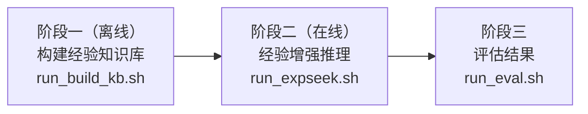

# ExpSeek 配置与参数说明文档

本文档为 ExpSeek 的完整参数参考手册，作为 README 的详细补充，涵盖所有配置项、离线构建流程和在线推理流程的说明。


## 目录

1. [系统概览](#1-系统概览)
2. [项目结构](#2-项目结构)
3. [完整流程图](#3-完整流程图)
4. [配置文件说明](#4-配置文件说明)
   - 4.1 [配置文件对比](#41-配置文件对比)
   - 4.2 [所有参数详解](#42-所有参数详解)
5. [分步骤操作指南](#5-分步骤操作指南)
   - 5.1 [启动 vLLM 推理服务](#51-启动-vllm-推理服务)
   - 5.2 [阶段一：离线知识库构建](#52-阶段一离线知识库构建)
   - 5.3 [阶段二：经验增强推理](#53-阶段二经验增强推理)
   - 5.4 [阶段三：评估](#54-阶段三评估)
6. [输出目录结构](#6-输出目录结构)
7. [知识库文件结构](#7-知识库文件结构)
8. [熵触发机制说明](#8-熵触发机制说明)
9. [适配其他模型](#9-适配其他模型)
10. [常见问题](#10-常见问题)


## 1. 系统概览

ExpSeek 的完整运行分为三个阶段，依次执行：





整个系统涉及以下几个模型角色：

| 角色 | 作用 | 默认配置 |
|------|------|---------|
| **推理模型** | 执行 ReAct 推理的 Web Agent | Qwen3-8B（本地 vLLM） |
| **熵计算模型** | 计算每步的 token 级熵值 | 与推理模型相同 |
| **引导模型** | 基于上下文和知识库生成 guidance | Qwen3-235B-A22B（API） |
| **摘要模型** | 在 visit 工具内部对网页内容做摘要 | Qwen3-235B-A22B（API） |
| **评估模型** | LLM-as-a-judge 评估预测是否正确 | Qwen3-235B-A22B（API） |

---

## 2. 项目结构

```
EXPSEEK-MAIN/
├── assets/                      # README 图片
├── configs/                     # 所有 YAML 配置文件
├── data/                        # 基准数据集
│   ├── gaia.jsonl               # GAIA benchmark
│   ├── seal-hard.jsonl          # SEAL-HARD benchmark
│   ├── xbench.jsonl             # xbench-DeepSearch benchmark
│   ├── webwalker_test.jsonl     # WebWalkerQA 测试集
│   ├── webwalker_train.jsonl    # WebWalkerQA 完整训练集（170 条）
│   └── webwalker_train_demo.jsonl  # 精简 demo 训练集（30 条）
├── experience_base/             # 经验知识库存放目录
│   └── demo/
│       ├── Qwen3-8B/            # demo KB（由 30 条训练样本构建）
│       │   └── embedding/       # embedding 索引（Step 6 产物）
│       └── Qwen3-8B-zh/         # 中文参考 KB（每个 topic 仅 1 条经验，仅供参考）
├── expseek/                     # 核心源代码
│   ├── agent/                   # Agent 逻辑（ReAct 循环、提示词）
│   ├── llm/                     # LLM 客户端工具
│   ├── tools/                   # Search 和 Visit 工具
│   └── trigger/                 # 熵计算服务器
├── offline/                     # 离线 KB 构建脚本（step1～step6）
├── outputs/                     # 推理输出目录（自动创建）
├── scripts/                     # run_inference.py、evaluate.py、metric.py
├── tokenizer/                   # 预置的 Qwen3-8B tokenizer
├── logs/                        # vLLM 服务日志（自动创建）
├── environment.yml
├── requirements.txt
├── run_build_kb.sh              # 阶段一入口
├── run_expseek.sh               # 阶段二入口
└── run_eval.sh                  # 阶段三入口
```

> **关于 `tokenizer/` 目录**：项目中已预置 Qwen3-8B 的 tokenizer，仅用于 token 计数（上下文长度预算检查和指标统计），开箱即用。如果你更换了推理模型，需要将该目录的内容替换为对应模型的 tokenizer，以保证 token 计数准确。

---

## 3. 完整流程图

```
webwalker_train_demo.jsonl（或完整训练集）
        │
        ▼
[启动 vLLM 服务]  ←─ scripts/start_vllm_8b.sh
        │
        ▼
[收集轨迹]  ←─ configs/vanilla-vllm-entropy.yaml
  run_inference.py → outputs/.../iter*.jsonl
        │
        ▼
[评估轨迹]  ←─ run_eval.sh
  outputs/.../eval_results/eval_round*.jsonl
        │
        ▼
[阶段一：构建知识库]  ←─ run_build_kb.sh
  ├── Step 1：聚合 rollout → pair.jsonl
  ├── Step 2：LLM 生成经验三元组 → pair-EXP.jsonl
  ├── Step 3：LLM 标注 topic → EXP-KB-process-label.jsonl
  │                              EXP-KB-final-label.jsonl
  ├── Step 4：构建结构化 KB → EXP-KB.json
  ├── Step 5：熵阈值分析 → entropy_threshold.png/pdf（默认开启）
  └── Step 6：构建 embedding 索引 → embedding/EXP-KB-embedding.json（默认关闭）
        │
        ▼
[阶段二：经验增强推理]  ←─ configs/expseek_core.yaml
  run_inference.py → outputs/.../iter*.jsonl
        │
        ▼
[阶段三：评估]  ←─ run_eval.sh
  evaluate.py → eval_results/eval_round*.jsonl
  metric.py   → metrics.txt
```
---

## 4. 配置文件说明

### 4.1 配置文件对比

项目提供 8 个配置文件，对应不同的运行模式。下表展示了关键开关的差异：

| 配置文件 | 用途 | `compute_entropy` | `need_guidance` | `use_guide_model` | `zero_exp` | `ablate` |
|---------|------|:-----------------:|:---------------:|:-----------------:|:----------:|:--------:|
| `vanilla-vllm.yaml` | 基础 ReAct，不计算熵 | ❌ | ❌ | ❌ | — | — |
| `vanilla-vllm-entropy.yaml` | 收集训练轨迹（构建 KB 用） | ✅ | ❌ | ❌ | — | — |
| `vanilla-api.yaml` | 基础 ReAct，使用 API 模型 | ❌ | ❌ | ❌ | — | — |
| `expseek_core.yaml` | **完整 ExpSeek（推荐）** | ✅ | ✅ | ✅ | ❌ | full |
| `expseek_zero.yaml` | 消融：不使用 KB，引导模型仅依赖自身知识 | ✅ | ✅ | ✅ | ✅ | full |
| `expseek_emb.yaml` | 消融：embedding 检索替代生成式引导 | ✅ | ✅ | ❌ | ❌ | full |
| `ablate_only_answer.yaml` | 消融：仅引导 answer 步 | ✅ | ✅ | ✅ | ❌ | only_answer |
| `ablate_only_process.yaml` | 消融：仅引导 process 步 | ✅ | ✅ | ✅ | ❌ | only_process |

> **注意**：`need_guidance: true` 必须同时设置 `compute_entropy: true`，否则系统启动时会抛出 `ValueError`。

---

### 4.2 所有参数详解

#### 模式开关

| 参数 | 类型 | 说明 |
|------|------|------|
| `compute_entropy` | bool | 是否启动熵计算服务并计算每步的 token 级平均熵。设为 `false` 时不占用额外 GPU，适用于 vanilla 基线。 |
| `need_guidance` | bool | 是否在推理过程中注入经验引导。必须在 `compute_entropy: true` 时才能开启。 |
| `use_guide_model` | bool | 当 `need_guidance: true` 时，控制引导内容的生成方式。`true` 表示使用两阶段 LLM 生成（topic 选择 + 引导生成）；`false` 表示使用 embedding 最近邻检索（需配置 `embedding_kb_path`）。 |
| `zero_exp` | bool | 设为 `true` 时，引导模型不读取经验知识库，仅凭自身世界知识生成引导。 |
| `ablate` | str | 控制哪些步骤类型会收到引导。`full` = process 步和 answer 步都引导；`only_process` = 仅 process 步；`only_answer` = 仅 answer 步。 |
| `guidance_interval` | int | 每次引导注入后的冷却步数。`0` = 无限制，每步都可触发；`1` = 注入后下一步静默；`2` = 注入后连续两步静默。增大该值会降低引导频率和 API 开销。 |

---

#### 熵计算模型

仅在 `compute_entropy: true` 时生效。熵计算模型运行在独立进程中，通过 multiprocessing queue 与主进程通信。

| 参数 | 类型 | 示例 | 说明 |
|------|------|------|------|
| `entropy_devices` | str | `"0,1"` | 分配给熵计算服务器的 GPU 编号，逗号分隔字符串。不使用时填 `"auto"` 作为占位符。 |
| `entropy_model_path` | str | `xxx/Qwen3-8B` | 熵计算模型的本地权重路径。建议与推理模型保持一致，以确保熵值分布具有可比性。不使用时填 `""`。 |
| `entropy_model_str` | str | `Qwen3-8B` | 模型的简短标识符，仅用于日志输出。不使用时填 `""`。 |

---

#### 熵阈值参数

这四个值定义了概率式触发区间，由训练集上的 bootstrap 重采样（Step 5）估计得到。详细机制见[第 8 节](#8-熵触发机制说明)。

| 参数 | 类型 | Qwen3-8B 推荐值 | Qwen3-32B 推荐值 | 说明 |
|------|------|:--------------:|:---------------:|------|
| `process_start` | float | `0.314` | `0.877` | process 步触发区间下界。熵低于此值时不触发（概率 = 0）。 |
| `process_end` | float | `0.413` | `1.384` | process 步触发区间上界。熵高于此值时必然触发（概率 = 1）。 |
| `final_start` | float | `0.225` | `0.714` | answer 步触发区间下界。 |
| `final_end` | float | `0.257` | `0.820` | answer 步触发区间上界。 |

> **关于 demo KB 的阈值**：项目提供的 demo 训练集仅有 30 条 query，由此估计的阈值因数据量不足而不够准确，仅供快速验证流程使用。若要正式实验，请使用完整的 170 条训练集（`webwalker_train.jsonl`）重新运行 Step 5 以获得准确阈值。上表中的推荐值来自论文，基于完整训练集估计。用户也可以在推荐值基础上自行调整尝试，详见[第 8 节](#8-熵触发机制说明)。

---

#### 经验知识库

| 参数 | 类型 | 说明 |
|------|------|------|
| `exp_kb_path` | str | 结构化经验 KB 的 JSON 文件路径（Step 4 产物 `EXP-KB.json`）。当 `need_guidance: false` 或 `zero_exp: true` 时填 `""`。 |
| `embedding_kb_path` | str | embedding 索引文件路径（Step 6 产物 `EXP-KB-embedding.json`）。仅在 `use_guide_model: false` 时需要，其余情况填 `""`。 |

---

#### 引导模型

仅在 `need_guidance: true` 且 `use_guide_model: true` 时生效。引导模型执行两阶段生成：首先从知识库中选出 3 个最相关的 topic，再基于这些 topic 下的经验三元组和当前上下文生成个性化引导。

| 参数 | 类型 | 说明 |
|------|------|------|
| `guide_model_name` | str | 引导模型名称。推荐使用 `qwen3-235b-a22b-instruct-2507` 以获得较高质量，也可替换为较小的模型以降低成本，详见[第 9 节](#9-适配其他模型)。 |
| `guide_api_base` | str | 引导模型的 API base URL。 |
| `guide_api_key` | str | 引导模型的 API key。 |

---

#### Embedding 模型

仅在 `use_guide_model: false`（即 `expseek_emb` 模式）时生效。

| 参数 | 类型 | 默认值 | 说明 |
|------|------|--------|------|
| `embedding_api_key` | str | — | embedding 服务的 API key。 |
| `embedding_api_base` | str | — | embedding 服务的 API base URL。 |
| `embedding_model_name` | str | `text-embedding-v4` | embedding 模型名称。必须与构建 `EXP-KB-embedding.json` 时使用的模型一致。 |
| `embedding_dimensions` | int | `1024` | embedding 向量维度。必须与构建 embedding 索引时的维度一致。 |

---

#### 推理模型

| 参数 | 类型 | 可选值 / 示例 | 说明 |
|------|------|--------------|------|
| `model_mode` | str | `vllm` / `api` | `vllm`：调用本地运行的 vLLM 服务（OpenAI 兼容接口）；`api`：直接调用远程 API 端点。 |
| `model_name` | str | `Qwen3-8B` | 模型名称。`vllm` 模式下必须与启动脚本中的 `--served-model-name` 一致；`api` 模式下必须与 API 的模型标识符一致。 |
| `api_base` | str | `http://localhost:8012/v1` | API base URL。`vllm` 模式默认指向本地服务器。 |
| `api_key` | str | `EMPTY` | API key。本地 vLLM 服务无需认证，填 `EMPTY` 即可。 |
| `temperature` | float | `1.0` | 采样温度。论文所有实验均使用 `1.0` 以保证多次 rollout 的多样性。 |
| `top_p` | float | `0.95` | nucleus sampling 阈值。 |

---

#### 摘要模型

摘要模型在 `visit` 工具内部使用，将网页内容压缩为与当前问题相关的简洁摘要，与引导机制无关。

| 参数 | 类型 | 说明 |
|------|------|------|
| `sum_model_name` | str | 摘要模型名称。 |
| `sum_api_base` | str | 摘要模型的 API base URL。 |
| `sum_api_key` | str | 摘要模型的 API key。 |

---

#### 运行设置

| 参数 | 类型 | 默认值 | 说明 |
|------|------|--------|------|
| `dataset` | str | `gaia` | 推理所用的数据集。必须对应 `data/{dataset}.jsonl` 文件。可选值：`gaia`、`seal-hard`、`xbench`、`webwalker_test`、`webwalker_train`、`webwalker_train_demo`。构建 KB 时收集轨迹请使用 `webwalker_train_demo`（demo）或 `webwalker_train`（完整）。 |
| `time_stamp` | str | `now` | 输出目录的时间戳。`now` 表示自动生成（格式 `YYYYMMDD_HH:MM:SS`）；也可填固定字符串（如 `exp01`）以使用固定目录名。消融配置会自动在时间戳后追加消融模式后缀（如 `20250113_14:00:00-only_answer`）。 |
| `use_debug` | bool | `false` | 设为 `true` 时以单进程串行执行所有任务，方便调试单条样本。 |
| `roll_out_count` | int | `5` | 每道题的独立 rollout 次数。每次 rollout 产生一个 `iter{N}.jsonl` 文件。论文报告的是 5 次 rollout 的平均准确率。 |
| `max_retries` | int | `3` | LLM API 调用和引导模型调用遇到格式错误或异常时的最大重试次数。 |
| `max_workers` | int | `5` | 推理时的并行 worker 进程数。每个 worker 运行一个独立的 agent 实例。GPU 显存不足或 API 速率受限时可适当减小。 |
| `max_call_per_run` | int | `30` | 每道题每次 rollout 的最大 LLM 调用次数（即最大 ReAct 步数）。超出限制的样本标记为失败。 |
| `response_budget` | int | `500` | 为模型下一次响应预留的 token 数。每次 LLM 调用前，系统检查：若当前上下文 token 数加上该预算超过 `max_tokens`，则注入强制答题提示而非继续 ReAct 循环，防止上下文溢出。 |
| `max_tokens` | int | `32768` | 传给推理模型的最大上下文长度（token 数）。应与模型实际支持的上下文窗口一致。 |

---

#### 工具配置

| 参数 | 类型 | 说明 |
|------|------|------|
| `visit_path` | str | URL 访问缓存文件路径（`.jsonl` 格式）。`visit` 工具每次访问 URL 后会将结果写入缓存；下次遇到相同 URL 时直接读取缓存，无需再调用 Jina API，可显著降低延迟和 API 成本。建议为不同实验指定不同的缓存文件名（如 `visit_memory_gaia.jsonl`），避免缓存文件过大影响读取速度。 |
| `jina_key` | str | [Jina](https://jina.ai) 的 API key，`visit` 工具用于抓取和解析网页内容。 |
| `brightdata_key` | str | [BrightData](https://www.bright.cn) 的 API key，`search` 工具使用。 |
| `brightdata_zone` | str | BrightData 的 zone 标识符。 |
| `brightdata_location` | str | 搜索结果的语言/地区偏好。`en` 返回英文结果。 |

---

## 5. 分步骤操作指南

### 5.1 启动 vLLM 推理服务

在运行任何推理之前，需要先启动 vLLM 服务：

```bash
bash scripts/start_vllm_8b.sh
```

**脚本中需要修改的关键变量：**

| 变量 | 默认值 | 说明 |
|------|--------|------|
| `MODEL_PATH` | `xxx/Qwen3-8B` | **必须修改**。本地 Qwen3-8B 模型权重的绝对路径。 |
| `MODEL_NAME` | `Qwen3-8B` | 服务的模型名称。必须与 YAML 配置中的 `model_name` 一致。 |
| `CUDA_VISIBLE_DEVICES` | `0,1` | 分配给推理服务的 GPU 编号。 |
| `--tensor_parallel_size` | `2` | 张量并行的 GPU 数量，必须与 `CUDA_VISIBLE_DEVICES` 中的设备数一致。 |
| `--gpu-memory-utilization` | `0.75` | vLLM 占用的 GPU 显存比例。默认留出余量供熵计算模型使用；若熵计算模型运行在完全独立的 GPU 上，可适当提高至 `0.90`。 |
| `--port` | `8012` | API 端口号，必须与 YAML 配置中 `api_base` 的端口一致。 |

**默认 GPU 分配方案：**

```
GPU 0, 1  →  vLLM 推理服务（Qwen3-8B）
GPU 2, 3  →  熵计算服务（Qwen3-8B）
```

日志输出至 `logs/vllm_qwen3_8b.log`，可通过以下命令实时查看：

```bash
tail -f logs/vllm_qwen3_8b.log
```

若需要运行 Qwen3-32B，参照该脚本自行调整 `MODEL_PATH`、`MODEL_NAME`、`CUDA_VISIBLE_DEVICES` 和 `--tensor_parallel_size`（通常需要 4 块 GPU）。

---

### 5.2 阶段一：离线知识库构建

所有六个步骤由 `run_build_kb.sh` 统一调度。运行前请先编辑脚本顶部的变量：

```bash
bash run_build_kb.sh
```

**脚本顶部变量说明：**

| 变量 | 默认值 | 说明 |
|------|--------|------|
| `EVAL_DIR` | `outputs/Qwen3-8B-webwalker_train_demo/eval_results` | 轨迹收集阶段产生的 `eval_results/` 目录路径，须包含 `eval_round*.jsonl` 文件。 |
| `EXP_KB_DIR` | `experience_base/demo/Qwen3-8B` | KB 构建产物的输出目录，不存在时自动创建。 |
| `API_KEY` | `sk-xxx` | Steps 2、3 使用的 LLM 的 API key。 |
| `API_BASE` | `https://dashscope.aliyuncs.com/...` | Steps 2、3 使用的 LLM 的 API base URL。 |
| `MODEL` | `qwen3-235b-a22b-instruct-2507` | Steps 2、3 使用的 LLM 模型名。模型越强，经验三元组和 topic 标注质量越好。 |
| `EMB_API_KEY` | `sk-xxx` | Step 6 使用的 embedding 服务 API key。 |
| `EMB_API_BASE` | `https://dashscope.aliyuncs.com/...` | Step 6 使用的 embedding 服务 API base URL。 |
| `EMB_MODEL` | `text-embedding-v4` | Step 6 使用的 embedding 模型名称。 |
| `EMB_NUM_WORKERS` | `16` | Step 6 的并发 embedding 请求线程数。 |
| `BATCH_SIZE` | `20` | Step 3 每次 LLM 调用处理的经验条目数。数值越大 API 调用次数越少，但标注质量可能下降。 |
| `NUM_WORKERS` | `20` | Step 2 的并行进程数。 |
| `RUN_EMBEDDING` | `false` | 设为 `true` 时运行 Step 6，构建 embedding 索引。仅在使用 `expseek_emb` 模式时需要开启。 |
| `RUN_THRESHOLD` | `true` | 设为 `false` 时跳过 Step 5（熵阈值分析）。Step 5 仅生成可视化图表，不会自动修改配置文件，需手动将打印的阈值填入 YAML。 |

---

#### Step 1 — 聚合 rollout 并创建轨迹对（`offline/step1_aggregate.py`）

**输入：** `{EVAL_DIR}/eval_round*.jsonl`  
**输出：** `{EXP_KB_DIR}/pair.jsonl`

读取所有评估 rollout，按问题分组后将每道题分为全对、全错、混合三类。对混合类问题，将每条错误轨迹与一条正确轨迹配对（正确轨迹不足时循环复用）。满足以下条件的错误轨迹会被跳过：prediction 为 `[Failed]`，或熵值列表为空。配对结果中 index `0` 为错误轨迹，index `1` 为正确轨迹。

脚本输出分类统计报告（总题数、全对/全错/混合数量、生成的配对数）。若 `pair.jsonl` 已存在则自动跳过，添加 `--overwrite` 参数可强制重跑。

---

#### Step 2 — 生成经验三元组（`offline/step2_generate_exp.py`）

**输入：** `{EXP_KB_DIR}/pair.jsonl`  
**输出：** `{EXP_KB_DIR}/pair-EXP.jsonl`

对每个轨迹对调用 LLM 两次：第一次逐步分析错误轨迹相对于正确轨迹的问题，为每个错误步骤生成 `(behavior, mistake, guidance)` 三元组；第二次将 LLM 输出的 markdown 格式转换为结构化 Python dict，便于后续处理。

每条样本最多重试 10 次，失败的样本会被跳过并记录。脚本支持按问题级别的断点续跑，中断后重启会自动跳过已完成的样本。并行进程数由 `run_build_kb.sh` 中的 `NUM_WORKERS` 控制。

---

#### Step 3 — 标注 topic（`offline/step3_label_topic.py`）

**输入：** `{EXP_KB_DIR}/pair-EXP.jsonl`  
**输出：**
- `{EXP_KB_DIR}/EXP-KB-process-label.jsonl`
- `{EXP_KB_DIR}/EXP-KB-final-label.jsonl`

首先将经验三元组按步骤类型拆分为两个池子：**process 经验**（来自非最终步骤）和 **final 经验**（来自 answer 步骤）。然后对每个池子分批调用 LLM 进行 topic 标注。LLM 在处理每批时可以复用已有 topic、创建新 topic 或修改已有 topic，使整体标签集保持紧凑且具有区分度。

脚本具备完善的断点续跑机制：每批处理完成后，进度保存为 `{EXP_KB_DIR}/EXP-KB-process-label-batches/batch{N}.jsonl`。中断后重启会自动从最新的 checkpoint 继续。`BATCH_SIZE` 控制每次 LLM 调用处理的经验条数，默认为 20。

---

#### Step 4 — 构建结构化知识库（`offline/step4_build_kb.py`）

**输入：**
- `{EXP_KB_DIR}/EXP-KB-process-label.jsonl`
- `{EXP_KB_DIR}/EXP-KB-final-label.jsonl`

**输出：** `{EXP_KB_DIR}/EXP-KB.json`

将带有 topic 标注的经验条目整理为最终的结构化 JSON 格式，供推理阶段直接加载使用。KB 的具体格式见[第 7 节](#7-知识库文件结构)。若 `EXP-KB.json` 已存在则自动跳过。

---

#### Step 5 — 熵阈值分析（`offline/step5_entropy_threshold.py`）

**输入：**
- `{EVAL_DIR}/eval_round*.jsonl`（提取正确轨迹的熵值）
- `{EXP_KB_DIR}/pair-EXP.jsonl`（提取错误轨迹的熵值）

**输出：**
- `{EXP_KB_DIR}/entropy_threshold.png`
- `{EXP_KB_DIR}/entropy_threshold.pdf`

对训练轨迹中正确步骤与错误步骤的熵值分布分别拟合逻辑回归模型，再通过 1000 次 bootstrap 重采样估计决策边界的 95% 置信区间，作为触发阈值区间。同时生成包含熵值分布、sigmoid 曲线和阈值直方图的可视化图表。

脚本运行结束后会打印阈值汇总，例如：

```
[Step5] Process Steps: lower=0.3140, median=0.3620, upper=0.4130
[Step5] Final Steps  : lower=0.2250, median=0.2390, upper=0.2570
```

> **重要**：Step 5 不会自动修改任何配置文件。运行完成后，需要手动将 `lower` 和 `upper` 填入对应 YAML 文件的四个阈值字段：
> ```yaml
> process_start: <Process Steps lower>
> process_end:   <Process Steps upper>
> final_start:   <Final Steps lower>
> final_end:     <Final Steps upper>
> ```

若 `.png` 和 `.pdf` 均已存在则自动跳过。由 `run_build_kb.sh` 中的 `RUN_THRESHOLD` 控制是否执行。

---

#### Step 6 — 构建 embedding 索引（`offline/step6_build_embedding.py`）

**输入：** `{EXP_KB_DIR}/EXP-KB.json`  
**输出：** `{EXP_KB_DIR}/embedding/EXP-KB-embedding.json`

将结构化 KB 展平，并为每条经验的 `behavior` 字段调用 embedding API 生成向量表示，构建用于最近邻检索的 embedding 索引。仅在使用 `expseek_emb` 模式（`use_guide_model: false`）时需要。**默认关闭**（`RUN_EMBEDDING=false`），需要时在 `run_build_kb.sh` 中设为 `true`。并发线程数由 `EMB_NUM_WORKERS` 控制，默认为 16。若输出文件已存在则自动跳过。

---

### 5.3 阶段二：经验增强推理

```bash
# 完整 ExpSeek（推荐）
python scripts/run_inference.py --config configs/expseek_core.yaml

# 或通过便捷脚本运行
bash run_expseek.sh
```

脚本自动检测已有 `iter{N}.jsonl` 文件中的完成情况，仅 `termination == "answer"` 且 `prediction != "[Failed]"` 的样本被视为已完成，失败样本自动重新加入队列。

**输出目录命名规则：**

```
outputs/{model_name}-{dataset}-{timestamp}/
```

消融配置会自动在时间戳后追加后缀，例如：

```
outputs/Qwen3-8B-gaia-20250113_14:00:00-only_answer/
```

每条 assistant 消息中记录的 **`guide_tag` 含义**：

| 值 | 含义 |
|----|------|
| `0` | 该步骤未注入引导 |
| `1` | process 步骤触发引导 |
| `2` | answer 步骤触发引导 |
| `3` | 触发 token 上限，强制答题 |
| `4` | 内容安全拦截 |
| `5` | 格式错误（未找到有效标签） |

---

### 5.4 阶段三：评估

```bash
bash run_eval.sh
```

**`run_eval.sh` 变量说明：**

| 变量 | 默认值 | 说明 |
|------|--------|------|
| `INPUT_DIR` | `outputs/Qwen3-8B-webwalker_train_demo` | 推理输出目录路径，须包含 `iter*.jsonl` 文件。 |
| `TOKENIZER_PATH` | `tokenizer` | tokenizer 目录路径，`metric.py` 用于统计对话历史的 token 数。 |
| `API_KEY` | `sk-xxx` | 评估模型的 API key。 |
| `API_BASE` | `https://dashscope.aliyuncs.com/...` | 评估模型的 API base URL。 |
| `JUDGE_MODEL` | `qwen3-235b-a22b-instruct-2507` | 用于判断预测是否正确的 LLM。模型越强，评估越可靠。注意不同评估模型可能产生不同的准确率数值，跨实验对比时应保持评估模型一致。 |
| `NUM_WORKERS` | `20` | LLM judge 调用的并行进程数。 |
| `DEBUG` | `false` | 设为 `true` 时串行执行，便于逐条检查判断结果。 |

---

#### evaluate.py — LLM-as-a-judge 评估

**输入：** `{INPUT_DIR}/iter*.jsonl`  
**输出：** `{INPUT_DIR}/eval_results/eval_round*.jsonl`

自动检测 rollout 数量。对每条样本调用评估模型，判断预测答案是否与标准答案等价。`prediction == "[Failed]"` 的样本直接标记为 `Incorrect`，不调用评估模型。支持按问题级别的断点续跑。

> **关于评估提示词**：默认提示词的判断标准为"只要标准答案包含在预测答案中即视为正确"。如需自定义，可修改 `scripts/evaluate.py` 顶部的 `JUDGE_PROMPT` 字符串。修改提示词后，评估结果与论文报告的数字可能不具有可比性。

---

#### metric.py — 指标计算

**输入：** `{INPUT_DIR}/eval_results/eval_round*.jsonl`  
**输出：** `{INPUT_DIR}/metrics.txt`

计算并输出完整的指标报告，涵盖以下内容：

| 指标 | 说明 |
|------|------|
| **各轮准确率** | 每次 rollout 的正确率 |
| **平均准确率** | 所有 rollout 的平均正确率（论文主要汇报指标） |
| **Pass@K** | 前 K 次 rollout 中至少有一次正确的比例，按问题平均 |
| **一致性统计** | 所有问题按全对/全错/混合分类的比例 |
| **平均步数** | 分别统计成功样本和全部样本的平均 ReAct 步数 |
| **平均 token 数** | 分别统计成功样本和全部样本的平均对话 token 数 |
| **时间统计** | 每条样本的平均、中位、最小、最大及总耗时 |
| **guide_tag 分布** | ExpSeek 运行时各类 guide_tag 占 assistant 总步数的比例及每条样本平均触发次数 |

---

## 6. 输出目录结构

完整运行后，输出目录结构如下：

```
outputs/
└── Qwen3-8B-gaia-20250113_14:00:00/
    ├── config_20250113_140000.yaml   # 本次运行的配置快照
    ├── iter1.jsonl                   # Rollout 1 的推理结果
    ├── iter2.jsonl                   # Rollout 2 的推理结果
    ├── iter3.jsonl
    ├── iter4.jsonl
    ├── iter5.jsonl
    └── eval_results/
        ├── eval_round1.jsonl         # Rollout 1 的评估结果
        ├── eval_round2.jsonl
        ├── eval_round3.jsonl
        ├── eval_round4.jsonl
        ├── eval_round5.jsonl
        └── metrics.txt               # 最终指标汇总
```

`iter{N}.jsonl` 中每行是一个 JSON 对象，包含以下字段：

| 字段 | 说明 |
|------|------|
| `question` | 原始问题 |
| `answer` | 标准答案 |
| `rollout_id` | rollout 编号（1 到 `roll_out_count`） |
| `raw_item` | 数据集原始条目 |
| `messages` | 完整对话历史 |
| `prediction` | Agent 最终预测答案，失败时为 `"[Failed]"` |
| `termination` | 终止原因：`"answer"`、`"exceed available llm calls"`、`"generate an answer as token limit reached"` 等 |
| `elapsed_time` | 该样本的墙钟耗时（秒） |

启用熵计算时，每条 assistant 消息额外包含：

| 字段 | 说明 |
|------|------|
| `token_entropy` | 各 token 的熵值列表 |
| `token_entropy_avg` | 该步骤的平均 token 熵（标量） |
| `guide_tag` | 该步骤的引导决策（0–5，含义见上表） |
| `topic_idxs` | 选中的 topic 索引列表，未触发引导时为空列表 |

每条 user 消息额外包含：

| 字段 | 说明 |
|------|------|
| `guide_content` | 该步骤注入的引导文本，未注入时为 `""` |

---

## 7. 知识库文件结构

Step 4 产生的 `EXP-KB.json` 结构如下：

```json
{
  "process_exp": {
    "label_pool": ["Topic A: ...", "Topic B: ...", "..."],
    "Topic A: ...": [
      {
        "exp_id": 1,
        "behavior": "Agent 搜索了 X 并找到了 Y...",
        "mistake": "Agent 未能验证 Z...",
        "guidance": "在得出结论前，应当检查..."
      }
    ],
    "Topic B: ...": [ "..." ]
  },
  "final_exp": {
    "label_pool": ["Topic C: ...", "Topic D: ..."],
    "Topic C: ...": [ "..." ]
  }
}
```

- **`process_exp`**：来自非最终步骤（tool call 步）的经验
- **`final_exp`**：来自 answer 步骤的经验
- **`label_pool`**：所有 topic 标签的有序列表，推理阶段 topic 选择时按此列表的索引引用
- 每个 topic 下是若干条 `(behavior, mistake, guidance)` 经验三元组

Step 6 产生的 `EXP-KB-embedding.json` 是展平后的版本：

```json
{
  "process_exp": [
    {
      "exp_id": 1,
      "label": "Topic A: ...",
      "behavior": "...",
      "mistake": "...",
      "guidance": "...",
      "behavior_embedding": [0.123, -0.456, "..."]
    }
  ],
  "final_exp": [ "..." ]
}
```

---

## 8. 熵触发机制说明

### 两种步骤类型

Agent 的每个 ReAct 步骤按输出内容分为两类：

| 步骤类型 | 判断条件 | 使用的阈值参数 |
|---------|---------|--------------|
| **Process 步骤** | 响应中包含 `<tool_call>` | `process_start`、`process_end` |
| **Answer 步骤** | 响应中包含 `<answer>` | `final_start`、`final_end` |

### 触发概率计算

计算当前步骤的平均 token 熵 `H` 后，根据对应阈值区间 `[start, end]` 确定触发概率：

- `H < start`：Safe Zone，概率为 0，不触发
- `start ≤ H ≤ end`：Buffer Zone，概率线性插值，随机决定是否触发
- `H > end`：Intervention Zone，概率为 1，必然触发

从触发概率中采样得到 0 或 1，若为 1 且冷却间隔允许（由 `guidance_interval` 控制），则启动引导生成流程。

### 如何获得阈值

运行 `offline/step5_entropy_threshold.py` 对训练轨迹进行分析，脚本会打印 process 步和 answer 步各自的 `lower`（对应 `start`）和 `upper`（对应 `end`）值，手动填入 YAML 即可。

> **再次提示**：使用 demo 训练集（30 条）估计的阈值因数据量不足可能不准确，正式实验请使用完整训练集（170 条）重新运行 Step 5。

### 调整干预强度

除阈值本身外，还可以通过以下方式调整整体干预频率：

| 调整方式 | 效果 |
|---------|------|
| 降低 `process_start` / `final_start` | 更多步骤进入 Buffer Zone，干预频率增加 |
| 提高 `process_end` / `final_end` | 更多步骤进入 Intervention Zone，低熵步骤也会被必然触发 |
| 降低 `guidance_interval` | 冷却时间缩短，干预更频繁 |
| 提高 `guidance_interval` | 冷却时间延长，干预更稀疏，API 开销降低 |

根据论文分析（§6.4），在 GAIA 上每条样本约 **2 次干预**时准确率接近峰值，超过约 6 次后性能提升趋于平缓而成本持续上升，供参考。

---

## 9. 适配其他模型

### 更换推理模型

1. 修改 `scripts/start_vllm_8b.sh` 中的 `MODEL_PATH` 和 `MODEL_NAME`
2. 修改 YAML 配置中的 `model_name` 和 `api_base`（如端口有变动）
3. 将 `tokenizer/` 目录中的内容替换为新模型对应的 tokenizer
4. 重新运行 Step 5 获取新模型的熵阈值，将结果填入 YAML 的四个阈值字段

### 更换引导模型

修改 YAML 中的 `guide_model_name` 即可。引导模型可以独立于推理模型选择，使用较小的引导模型可以显著降低 API 成本，同时仍能带来可观的性能提升。

### 适配 `/no_think` 标记

代码中所有发送给推理模型的 user 消息末尾都附加了 `/no_think`，这是 Qwen3 特有的非思考模式触发标记，用于抑制模型输出内部的 `<think>` 链。如果更换为其他模型，需要修改 `expseek/agent/react_agent.py`，移除或替换该后缀为目标模型对应的机制。

---

## 10. 常见问题

**熵计算服务器启动后主进程一直等待**

主进程会无限等待熵服务器的 `ready_event` 信号。若熵模型加载失败，请检查 YAML 中 `entropy_devices` 指定的 GPU 编号是否与 vLLM 服务器占用的 GPU 存在冲突，以及模型路径 `entropy_model_path` 是否正确。

**Step 2 频繁出现 STEP 数量不匹配错误**

LLM 未能生成与轨迹步数完全一致的 STEP 数量，脚本会自动重试最多 10 次。若持续失败，可尝试换用更强的 `MODEL`，或降低 `NUM_WORKERS` 以减轻 API 速率压力。

**Step 3 不同批次间 topic 标签不一致**

这是预期行为。LLM 在处理后续批次时可能会修改前面批次的标签，最终 `EXP-KB-process-label.jsonl` 中的标签以最后一批的结果为准（包含对所有之前批次的修订）。若希望标签更稳定，可适当减小 `BATCH_SIZE`。

**`visit_path` 缓存文件过大导致速度变慢**

随着实验积累，缓存文件中的 URL 记录会持续增长，过大时会拖慢读取速度。建议为不同实验在 YAML 中配置不同的缓存文件名，例如：

```yaml
visit_path: expseek/tools/visit_memory_gaia.jsonl
```

**推理中断后续跑时部分样本被重新运行**

只有 `termination == "answer"` 的样本被视为已完成。触发 token 上限（`termination == "generate an answer as token limit reached"`）或超出调用预算（`termination == "exceed available llm calls"`）的样本会在续跑时重新执行，这是有意为之的设计，因为这些样本未产生干净的答案。

